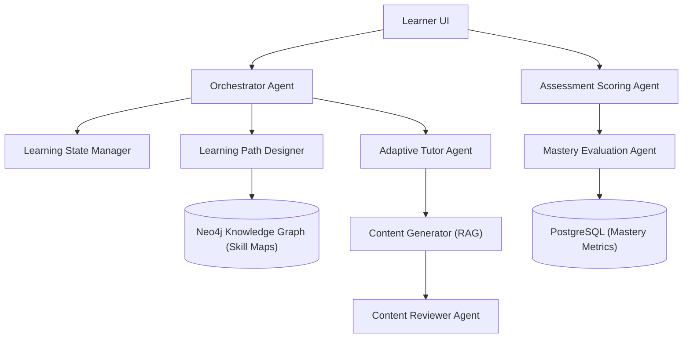

# 🎓 Competency Intelligence Platform (CIP) — MVP Blueprint

  
   
  <em>Visualization of the 9-Agent learning graph and mastery validation paths</em>

This repository contains the architecture specifications, database schemas, and agent configuration blueprints for the **AI-Powered Competency Intelligence Platform (CIP)**. Designed to run on **Google Antigravity 2.0**, this system automates the lifecycle of skill profiling, learning path design, assessment generation, and mastery evaluation.

---

## 🏗️ 9-Agent Orchestration Architecture

The system utilizes a 9-agent model organized using stateful **LangGraph** orchestrators, keeping track of learner progress through a 4-tier memory schema (PostgreSQL, Neo4j, Redis, and LangGraph checkpointers).

### The 9 Core Agents:
1. **Competency Architect**: Designs and maintains skill structures in Neo4j.
2. **Learning State Manager**: Captures and saves individual learner progress.
3. **Assessment Scoring Agent**: Processes test responses with granular error classification.
4. **Content Generator**: Utilizes RAG systems to synthesize custom, context-aligned training cards.
5. **Content Reviewer**: Inspects generated materials to guarantee pedagogical safety.
6. **Learning Path Designer**: Performs Dijkstra/A* traversals on the Skill Graph to outline target milestones.
7. **Adaptive Tutor**: Coordinates interactive dialog sessions via WebSockets.
8. **Mastery Evaluation Agent**: Determines skill graduation and readiness to transition to new lessons.
9. **Orchestrator Agent**: Manages central conversation state routes.

---

## 📁 Repository Directory & Specifications

This repository contains complete specifications for the implementation of the platform:
* [infrastructure_setup_1.md](infrastructure_setup_1.md): Docker configurations and local development stack commands.
* [database_schema_models_2.md](database_schema_models_2.md): PostgreSQL DDL, Neo4j graph nodes and relationship constraints.
* [authentication_security_3.md](authentication_security_3.md): JWT schemes and Auth0 token configurations.
* [neo4j_knowledge_graph_4.md](neo4j_knowledge_graph_4.md): Cypher query utilities and indexing schemas.
* [langgraph_orchestrator_5.md](langgraph_orchestrator_5.md): LangGraph state machine configurations, nodes, and routers.
* [competency_architect_agent_6.md](competency_architect_agent_6.md): Competency decomposition pipeline utilizing structured LLM outputs.
* [competency_api_decomposition_7.md](competency_api_decomposition_7.md): Fast API endpoints for graph updates.
* [learning_state_manager_agent_8.md](learning_state_manager_agent_8.md): Redis state synchronization logic.
* [assessment_scoring_agent_9.md](assessment_scoring_agent_9.md): Scoring models and granular metric logging.
* [content_generator_rag_10.md](content_generator_rag_10.md): Vector-search RAG ingestion pipeline.
* [content_reviewer_agent_11.md](content_reviewer_agent_11.md): Compliance checklist validator logic.
* [learning_path_designer_agent_12.md](learning_path_designer_agent_12.md): Graph routing path algorithms (Dijkstra/A*).
* [adaptive_tutor_agent_13.md](adaptive_tutor_agent_13.md): WebSocket endpoints for dialog loops.
* [mastery_evaluation_agent_14.md](mastery_evaluation_agent_14.md): Skill metrics and graduation gate requirements.
* [learning_session_graph_websocket_15.md](learning_session_graph_websocket_15.md): Bidirectional socket state definitions.
* [employee_session_apis_16.md](employee_session_apis_16.md): Learner API specs.
* [manager_dashboard_api_17.md](manager_dashboard_api_17.md): Analytical API endpoints.
* [frontend_manager_portal_18.md](frontend_manager_portal_18.md) & [frontend_employee_portal_19.md](frontend_employee_portal_19.md): UI mockups and component mappings.
* [observability_testing_20.md](observability_testing_20.md): LangSmith tracing and unit testing guides.
* [deployment_devops_21.md](deployment_devops_21.md): CI/CD actions and AWS ECS deploy scripts.
