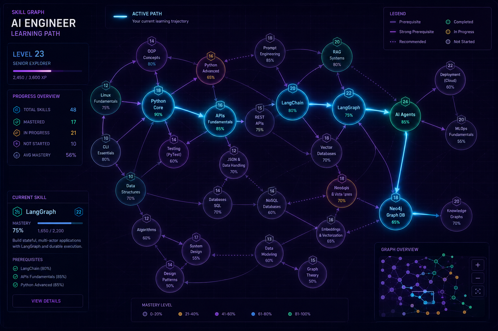
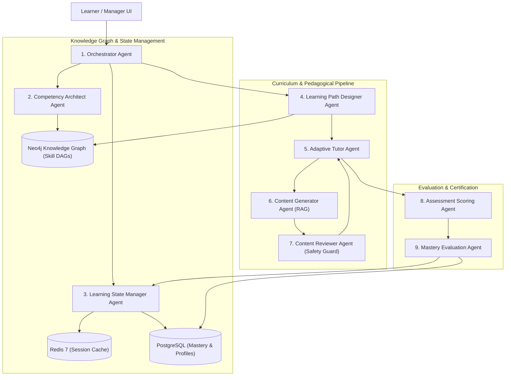

# 🎓 Competency Intelligence Platform (CIP) — Enterprise Multi-Agent Skill Engine

[](https://www.python.org/)
[](https://fastapi.tiangolo.com/)
[](https://react.dev/)
[](https://www.typescriptlang.org/)
[](https://github.com/langchain-ai/langgraph)
[](https://neo4j.com/)
[](https://www.postgresql.org/)
[](https://redis.io/)
[](https://build.nvidia.com/)
[](https://www.docker.com/)
[](LICENSE)
[](https://www.linkedin.com/in/vignesh-manivasakam)

<p align="center">
  
  <br>
  <em>Production-grade multi-agent platform automating enterprise competency decomposition, personalized DAG learning path routing, and real-time WebSocket mastery tutoring.</em>
</p>

---

## 🏛️ Executive Overview

The **Competency Intelligence Platform (CIP)** is an end-to-end, enterprise-scale platform engineered to solve organizational skill decay, fragmented training programs, and unverified capability claims. 

Built on a **9-Agent stateful LangGraph orchestrator** and a **4-tier memory architecture**, the system automates:
1. **Automated Competency Decomposition**: Ingests unstructured role guidelines and decomposes them into Directed Acyclic Graphs (DAGs) of prerequisite and core skills stored in **Neo4j**.
2. **Personalized Dynamic Learning Paths**: Applies Dijkstra and A* graph traversals to calculate the optimal learning trajectory tailored to each engineer's baseline knowledge.
3. **Real-Time Interactive Tutoring**: Conducts bidirectional WebSocket dialog sessions where an adaptive tutor synthesizes verified RAG training cards, evaluates understanding, and dynamically shifts pedagogical strategies.
4. **Closed-Loop Mastery Verification**: Employs an independent evaluation agent and Bayesian knowledge tracing to certify skill acquisition before logging mastery metrics to **PostgreSQL**.

---

## 🏗️ 9-Agent Orchestration Architecture



### The 9 Specialized Agents:
* **1. Orchestrator Agent**: Central state machine router managing intent classification, multi-tenant session isolation, and cross-agent event distribution.
* **2. Competency Architect**: Decomposes high-level competency specifications into fine-grained skills, prerequisite relationships, and Bloom taxonomy levels using structured schema extraction.
* **3. Learning State Manager**: Tracks real-time learner engagement, retention intervals, and interaction counts, synchronizing memory between Redis and PostgreSQL.
* **4. Learning Path Designer**: Executes graph pathfinding algorithms over the Neo4j skill topology to construct non-linear, personalized learning journeys.
* **5. Adaptive Tutor**: Drives low-latency, bidirectional WebSocket conversations, employing Socratic questioning, code evaluation, and concept clarification.
* **6. Content Generator**: Synthesizes bite-sized, context-aligned instructional cards on the fly using hybrid vector and graph retrieval.
* **7. Content Reviewer**: Acts as a strict compliance guardrail, validating that generated instructional content is accurate, pedagogically sound, and free of hallucination.
* **8. Assessment Scoring Agent**: Evaluates user quiz submissions and open-ended technical responses with multi-criteria rubrics and semantic alignment metrics.
* **9. Mastery Evaluation Agent**: Evaluates cumulative evidence (interaction depth, assessment scores, consistency) to issue authoritative mastery certifications.

---

## 💾 4-Tier Memory & Storage Topology

```
┌─────────────────────────────────────────────────────────────────────────┐
│ Tier 1: Neo4j 5.15 Graph Database                                       │
│ • Skill nodes, prerequisite edges, domain taxonomies, DAG hierarchy     │
├─────────────────────────────────────────────────────────────────────────┤
│ Tier 2: PostgreSQL 16 + pgvector                                        │
│ • Multi-tenant users, auth credentials, course catalogs, audit logs     │
│ • 1536-dimensional HNSW vector index for contextual documentation       │
├─────────────────────────────────────────────────────────────────────────┤
│ Tier 3: Redis 7 In-Memory Cache                                         │
│ • Active WebSocket session buffers, rate limits, ephemeral tutor states │
├─────────────────────────────────────────────────────────────────────────┤
│ Tier 4: LangGraph Checkpointers                                         │
│ • Stateful agent conversation threads, execution rollbacks, replays     │
└─────────────────────────────────────────────────────────────────────────┘
```

---

## 🖥️ Dual Enterprise Portals

The platform ships with a unified, high-performance React 18 / Vite frontend featuring two role-tailored dashboards:

### 1. Employee Learner Portal
* **Interactive Skill DAG Editor**: Visualizes prerequisite requirements using `@xyflow/react` (React Flow) with interactive nodes indicating `Locked`, `In Progress`, or `Mastered` states.
* **Real-Time WebSocket Socratic Tutor**: Low-latency chat interface featuring Markdown rendering, LaTeX math formatting, code syntax highlighting, and live progress indicators.
* **Dynamic Mastery Score Bar**: Real-time visualization of confidence scores and Bloom taxonomy graduation thresholds.

### 2. Engineering Manager Portal
* **Team Competency Heatmaps**: Aggregated radar charts and progress distributions showing organizational capability readiness.
* **Skill Decomposition Wizard**: Intuitive visual workflow for senior architects to upload role descriptions and visually inspect the AI-generated skill graph before publishing.
* **Audit & Certification Ledger**: Tamper-proof history of assessment attempts, time-to-mastery telemetry, and certification milestones.

---

## ⚡ Multi-Provider LLM Router with NVIDIA NIM

The backend features a resilient, multi-tiered LLM routing service that dynamically balances inference cost, latency, and reasoning depth:

* **Primary High-Throughput Tier**: **NVIDIA NIM** running `meta/llama-3.1-70b-instruct` and `meta/llama-3.1-8b-instruct` for ultra-low latency Socratic tutoring and assessment scoring.
* **Complex Reasoning Tier**: **OpenAI GPT-4o** / **Anthropic Claude 3.5 Sonnet** for initial competency graph decomposition and edge validation.
* **Resilient Fallbacks**: Automated failover with exponential backoff (`tenacity`) across OpenAI, Anthropic, and Google Gemini.

---

## 📁 Repository Structure

```text
Competency/
├── competency-platform/                 # Complete Production Source Code
│   ├── backend/                         # FastAPI & LangGraph Architecture
│   │   ├── alembic/                     # PostgreSQL database migrations
│   │   ├── app/
│   │   │   ├── agents/                  # 9 specialized LangGraph agent definitions
│   │   │   ├── api/v1/                  # REST & WebSocket API routers
│   │   │   ├── core/                    # Security, database, Neo4j & Redis clients
│   │   │   ├── graphs/                  # Stateful LangGraph execution workflows
│   │   │   ├── models/                  # SQLAlchemy ORM database models
│   │   │   ├── schemas/                 # Pydantic v2 validation models
│   │   │   └── services/                # LLM router, LangSmith tracing, graph engine
│   │   ├── scripts/                     # Seeding utilities & validation suites
│   │   └── tests/                       # Unit, integration & LLM eval tests
│   ├── frontend/                        # React 18 + Vite + TypeScript Portals
│   │   ├── src/
│   │   │   ├── components/              # React Flow DAGs, Radar charts, Chat UI
│   │   │   ├── hooks/                   # Custom WebSocket & API query hooks
│   │   │   ├── pages/                   # Employee and Manager view routes
│   │   │   └── store/                   # Zustand authentication & session stores
│   │   └── tests/                       # Playwright E2E test suite
│   ├── docker/                          # Production Dockerfiles & Nginx configs
│   ├── docker-compose.yml               # Complete 5-service container stack
│   └── docker-compose.dev.yml           # Hot-reloading local development stack
├── assets/                              # Architecture diagrams & UI visual assets
├── database_schema_models_2.md          # Formal specifications for all 21 blueprints
└── README.md                            # Main project manual
```

---

## 🚀 Quick Start Guide

### Option 1: Complete Stack via Docker Compose (Recommended)

1. **Clone the repository**:
   ```bash
   git clone https://github.com/Vignesh-Manivasakam/Competency.git
   cd Competency/competency-platform
   ```

2. **Configure environment variables**:
   ```bash
   cp .env.example .env
   # Populate OPENAI_API_KEY, NVIDIA_API_KEY, or ANTHROPIC_API_KEY in .env
   ```

3. **Start all 5 services**:
   ```bash
   docker-compose up -d
   ```
   * **Learner & Manager Portals**: `http://localhost:3000`
   * **FastAPI OpenAPI Swagger**: `http://localhost:8000/docs`
   * **Neo4j Browser**: `http://localhost:7474`
   * **PostgreSQL pgvector**: `localhost:5432`

---

### Option 2: Local Development Setup

#### Backend Setup
```bash
cd competency-platform/backend
python -m venv venv
# On Windows:
.\venv\Scripts\activate
# On Linux/macOS:
# source venv/bin/activate

pip install -r requirements.txt
alembic upgrade head
python scripts/seed_users.py
uvicorn app.main:app --reload --port 8000
```

#### Frontend Setup
```bash
# In a new terminal from repository root (or cd ../frontend from backend):
cd competency-platform/frontend
npm install
npm run dev
# Running on http://localhost:5173
```

---

## 🧪 Testing & Verification

The codebase includes comprehensive test suites across unit, integration, and E2E layers:

```bash
# Run backend unit and integration tests
cd competency-platform/backend
pytest tests/unit tests/integration -v

# Run Playwright end-to-end learner journey tests
cd ../frontend
npx playwright test
```

---

## 🛡️ License
Distributed under the [MIT License](LICENSE).

---

## 👤 Author
**Vignesh Manivasakam**
- 💼 LinkedIn: [Vignesh Manivasakam](https://www.linkedin.com/in/vignesh-manivasakam)
- 🐙 GitHub: [@Vignesh-Manivasakam](https://github.com/Vignesh-Manivasakam)
- 📧 Email: [vicky.manivasagam@gmail.com](mailto:vicky.manivasagam@gmail.com)
