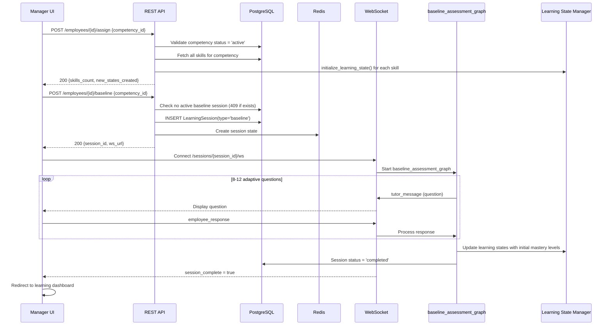

# Employee & Session REST API Endpoints

## Plan 16 of 21 — Competency Intelligence Platform MVP

---

### Objective

Implement all employee management, learning session lifecycle, mastery evaluation, and assessment REST API endpoints. This plan wires the backend service layer (Plans 8, 14, 15) to HTTP routes, enforcing RBAC permissions, pagination, and the complete baseline assessment flow described in §21.2.

### Prerequisites

- **Plan 3** (Auth & Security) — JWT validation, `get_current_user`, `require_role` dependencies, `PlatformError`
- **Plan 2** (DB Schema) — `User`, `LearningSession`, `EmployeeLearningState`, `AssessmentResult`, `MasteryHistory`, `Competency`, `Skill` SQLModel models
- **Plan 8** (Learning State Manager) — `LearningStateManagerAgent` for all state read/write operations
- **Plan 15** (Session Graph + WS) — `build_learning_session_graph`, `build_baseline_assessment_graph` compiled graphs

### Spec References

| Section | Content |
|---------|---------|
| §8.4 | Employee and Learning State Routes — GET/POST employees, assignments, learning state, competency matrix, history |
| §8.5 | Learning Session Routes — session CRUD, interact, pause/resume/end |
| §8.7 | Mastery and Assessment Routes — mastery evaluation trigger, decision detail, assessment results |
| §21.2 | Flow 2: Employee Baseline Assessment — assign → baseline → WebSocket → learning states initialised |
| §7 | Pydantic Schemas — SessionCreateRequest, SessionInteractRequest/Response, LearningStateOut, CompetencyMatrixOut |
| §9.3 | Dependency Injection Pattern — require_role('manager', 'admin') for manager-only routes |
| §19.2 | Error codes — SESSION_NOT_FOUND, SESSION_ALREADY_ACTIVE, PREREQUISITE_NOT_MET, COMPETENCY_NOT_VALIDATED, INSUFFICIENT_ASSESSMENT_DATA |

---

### Files to Create/Modify

```
competency-platform/backend/app/
├── api/v1/
│   ├── employees.py      # Employee management + assignment + learning state endpoints
│   ├── sessions.py       # Session lifecycle REST endpoints (create, interact, pause/resume/end)
│   ├── mastery.py        # Mastery evaluation trigger + decision detail endpoints
│   └── assessments.py    # Assessment result query endpoints
├── schemas/
│   └── session.py        # Pydantic request/response models for sessions and employees
└── main.py               # Update: register new routers under /api/v1
```

---

### Detailed Implementation Steps

#### Step 1: Pydantic Request/Response Schemas (§7)

```python
# app/schemas/session.py
"""Pydantic schemas for session and employee API endpoints.

From §7 — all schemas listed in the spec's Pydantic Models section.
"""
import uuid
from datetime import datetime
from typing import Optional
from pydantic import BaseModel, Field, UUID4


# --- Employee Schemas ---

class EmployeeCreateRequest(BaseModel):
    email: str
    password: str = Field(..., min_length=8)
    full_name: str
    job_title: Optional[str] = None
    department: Optional[str] = None


class EmployeeOut(BaseModel):
    id: UUID4
    email: str
    full_name: str
    role: str
    job_title: Optional[str] = None
    department: Optional[str] = None
    is_active: bool
    created_at: Optional[datetime] = None

    class Config:
        from_attributes = True


class EmployeeAssignRequest(BaseModel):
    """§21.2 Step 1: Assign employee to a competency version."""
    competency_id: UUID4
    competency_version: Optional[str] = None  # e.g. "1.0"; defaults to latest


class BaselineAssessmentRequest(BaseModel):
    """§21.2 Step 2: Trigger baseline assessment session."""
    competency_id: UUID4


class BaselineAssessmentResponse(BaseModel):
    session_id: UUID4
    ws_url: str  # /api/v1/sessions/{id}/ws
    message: str = "Baseline assessment session created. Connect via WebSocket."


# --- Session Schemas (§7) ---

class SessionCreateRequest(BaseModel):
    employee_id: UUID4
    skill_id: UUID4
    session_type: str = Field(
        default="learning",
        pattern="^(baseline|learning|review)$",
    )


class SessionOut(BaseModel):
    id: UUID4
    employee_id: UUID4
    skill_id: UUID4
    competency_id: UUID4
    status: str
    session_type: str
    started_at: Optional[datetime] = None
    ended_at: Optional[datetime] = None
    interaction_count: int = 0
    final_score: Optional[float] = None
    mastery_reached: bool = False

    class Config:
        from_attributes = True


class SessionInteractRequest(BaseModel):
    """HTTP polling fallback for WebSocket — §8.5."""
    session_id: UUID4
    employee_response: str
    response_latency_ms: Optional[int] = None


class SessionInteractResponse(BaseModel):
    session_id: UUID4
    tutor_message: str
    next_action: str
    current_score: Optional[float] = None
    interaction_count: int
    mastery_level: Optional[int] = None
    session_complete: bool = False
    feedback_points: list[str] = Field(default_factory=list)


class TranscriptEntry(BaseModel):
    role: str  # "tutor" | "employee"
    content: str
    timestamp: Optional[datetime] = None


class TranscriptOut(BaseModel):
    session_id: UUID4
    entries: list[TranscriptEntry]
    total_entries: int


# --- Learning State Schemas (§7) ---

class LearningStateOut(BaseModel):
    employee_id: UUID4
    skill_id: UUID4
    current_score: float
    mastery_level: int
    mastery_confidence: float
    knowledge_gaps: list[dict] = Field(default_factory=list)
    total_interactions: int
    last_assessed_at: Optional[datetime] = None

    class Config:
        from_attributes = True


class SkillMatrixEntry(BaseModel):
    skill_id: UUID4
    skill_name: str
    mastery_level: int
    current_score: float
    last_assessed_at: Optional[datetime] = None


class CompetencyMatrixOut(BaseModel):
    employee_id: UUID4
    competency_id: UUID4
    competency_name: str
    skills: list[SkillMatrixEntry]
    overall_progress_pct: float


# --- Mastery Schemas (§8.7) ---

class MasteryEvaluateRequest(BaseModel):
    employee_id: UUID4
    skill_id: UUID4


class MasteryDecisionOut(BaseModel):
    employee_id: UUID4
    skill_id: UUID4
    old_level: Optional[int] = None
    new_level: int
    decision: str  # UPGRADE | MAINTAIN | DOWNGRADE
    confidence: Optional[float] = None
    evidence_summary: Optional[str] = None
    decided_by: str = "ai"
    session_id: Optional[UUID4] = None
    created_at: Optional[datetime] = None

    class Config:
        from_attributes = True


# --- Assessment Schemas (§8.7) ---

class AssessmentOut(BaseModel):
    id: UUID4
    session_id: UUID4
    employee_id: UUID4
    skill_id: UUID4
    assessment_mode: Optional[str] = None
    prompt_text: str
    response_text: str
    response_latency_ms: Optional[int] = None
    composite_score: float
    score_accuracy: Optional[float] = None
    score_application: Optional[float] = None
    score_reasoning: Optional[float] = None
    score_consistency: Optional[float] = None
    score_confidence: Optional[float] = None
    misconceptions: list = Field(default_factory=list)
    feedback_points: list = Field(default_factory=list)
    created_at: Optional[datetime] = None

    class Config:
        from_attributes = True


# --- Pagination ---

class PaginatedResponse(BaseModel):
    items: list
    total: int
    page: int
    page_size: int
    total_pages: int
```

#### Step 2: Employee Router (§8.4)

```python
# app/api/v1/employees.py
"""Employee management, assignment, and learning state endpoints.

§8.4 Employee and Learning State Routes
§21.2 Flow 2: Employee Baseline Assessment
§9.3 RBAC: require_role('manager', 'admin') for management routes
"""
import uuid
import math
from datetime import datetime
from typing import Optional

import structlog
from fastapi import APIRouter, Depends, HTTPException, Query, status
from sqlmodel import select, func, col
from sqlmodel.ext.asyncio.session import AsyncSession
from redis.asyncio import Redis

from app.api.dependencies import get_current_user, require_role, get_async_session, get_redis
from app.core.errors import PlatformError
from app.core.security import get_password_hash
from app.models.user import User
from app.models.competency import Competency, Skill
from app.models.learning_state import EmployeeLearningState
from app.models.session import LearningSession
from app.models.assessment import AssessmentResult, MasteryHistory
from app.agents.learning_state_manager import LearningStateManagerAgent
from app.schemas.session import (
    EmployeeCreateRequest,
    EmployeeOut,
    EmployeeAssignRequest,
    BaselineAssessmentRequest,
    BaselineAssessmentResponse,
    LearningStateOut,
    CompetencyMatrixOut,
    SessionOut,
    AssessmentOut,
    PaginatedResponse,
)

logger = structlog.get_logger()

router = APIRouter(prefix="/employees", tags=["employees"])


# --- GET /employees — List employees (manager scope) ---
@router.get("", response_model=PaginatedResponse)
async def list_employees(
    page: int = Query(1, ge=1),
    page_size: int = Query(20, ge=1, le=100),
    department: Optional[str] = None,
    search: Optional[str] = None,
    db: AsyncSession = Depends(get_async_session),
    current_user: User = Depends(require_role("manager", "admin")),
):
    """List employees scoped to the manager's tenant (§8.4, §9.3).
    Managers can only see employees within their own tenant.
    """
    query = select(User).where(
        User.tenant_id == current_user.tenant_id,
        User.role == "employee",
    )
    count_query = select(func.count(User.id)).where(
        User.tenant_id == current_user.tenant_id,
        User.role == "employee",
    )

    if department:
        query = query.where(User.department == department)
        count_query = count_query.where(User.department == department)

    if search:
        query = query.where(
            col(User.full_name).ilike(f"%{search}%")
            | col(User.email).ilike(f"%{search}%")
        )
        count_query = count_query.where(
            col(User.full_name).ilike(f"%{search}%")
            | col(User.email).ilike(f"%{search}%")
        )

    total = (await db.exec(count_query)).one()
    total_pages = math.ceil(total / page_size) if total > 0 else 1

    offset = (page - 1) * page_size
    query = query.offset(offset).limit(page_size).order_by(User.full_name)
    result = await db.exec(query)
    employees = result.all()

    return PaginatedResponse(
        items=[EmployeeOut.model_validate(e) for e in employees],
        total=total,
        page=page,
        page_size=page_size,
        total_pages=total_pages,
    )


# --- POST /employees — Create employee account ---
@router.post("", response_model=EmployeeOut, status_code=status.HTTP_201_CREATED)
async def create_employee(
    body: EmployeeCreateRequest,
    db: AsyncSession = Depends(get_async_session),
    current_user: User = Depends(require_role("manager", "admin")),
):
    """Create a new employee account in the manager's tenant (§8.4).
    Only managers and admins can create employee accounts.
    """
    # Check for duplicate email
    existing = await db.exec(select(User).where(User.email == body.email))
    if existing.first():
        raise PlatformError(
            code="DUPLICATE_EMAIL",
            message="An account with this email already exists",
            status_code=409,
        )

    employee = User(
        email=body.email,
        hashed_password=get_password_hash(body.password),
        full_name=body.full_name,
        role="employee",
        job_title=body.job_title,
        department=body.department,
        tenant_id=current_user.tenant_id,
    )
    db.add(employee)
    await db.commit()
    await db.refresh(employee)

    logger.info("employee_created", employee_id=str(employee.id), by=str(current_user.id))
    return EmployeeOut.model_validate(employee)


# --- GET /employees/{id} — Get employee profile ---
@router.get("/{employee_id}", response_model=EmployeeOut)
async def get_employee(
    employee_id: uuid.UUID,
    db: AsyncSession = Depends(get_async_session),
    current_user: User = Depends(get_current_user),
):
    """Get employee profile (§8.4).
    Employees can view their own profile; managers/admins can view any
    employee in their tenant.
    """
    employee = await db.get(User, employee_id)
    if not employee or employee.tenant_id != current_user.tenant_id:
        raise HTTPException(status_code=404, detail="Employee not found")

    # Employees can only view their own profile
    if current_user.role == "employee" and employee.id != current_user.id:
        raise HTTPException(status_code=403, detail="Insufficient permissions")

    return EmployeeOut.model_validate(employee)


# --- POST /employees/{id}/assign — Assign employee to competency (§21.2 Step 1) ---
@router.post("/{employee_id}/assign", status_code=status.HTTP_200_OK)
async def assign_employee_to_competency(
    employee_id: uuid.UUID,
    body: EmployeeAssignRequest,
    db: AsyncSession = Depends(get_async_session),
    redis: Redis = Depends(get_redis),
    current_user: User = Depends(require_role("manager", "admin")),
):
    """Assign employee to a competency version (§21.2 Step 1).
    Creates EmployeeLearningState rows for all skills in the competency.
    Competency must be in 'active' status (validated).
    """
    # Validate employee exists in tenant
    employee = await db.get(User, employee_id)
    if not employee or employee.tenant_id != current_user.tenant_id:
        raise HTTPException(status_code=404, detail="Employee not found")

    # Validate competency is active (§19.2 COMPETENCY_NOT_VALIDATED)
    competency = await db.get(Competency, body.competency_id)
    if not competency or competency.tenant_id != current_user.tenant_id:
        raise HTTPException(status_code=404, detail="Competency not found")

    if competency.status != "active":
        raise PlatformError(
            code="COMPETENCY_NOT_VALIDATED",
            message="Competency must be in 'active' status before assignment",
            detail=f"Current status: {competency.status}",
            status_code=409,
        )

    # Fetch all skills for this competency
    result = await db.exec(
        select(Skill).where(Skill.competency_id == competency.id)
    )
    skills = result.all()

    if not skills:
        raise PlatformError(
            code="COMPETENCY_NOT_VALIDATED",
            message="Competency has no skills defined",
            status_code=409,
        )

    # Initialize learning state for each skill (skip if already exists)
    state_mgr = LearningStateManagerAgent(db, redis)
    created_count = 0

    for skill in skills:
        existing = await db.exec(
            select(EmployeeLearningState).where(
                EmployeeLearningState.employee_id == employee_id,
                EmployeeLearningState.skill_id == skill.id,
            )
        )
        if not existing.first():
            await state_mgr.initialize_learning_state(
                employee_id=str(employee_id),
                skill_id=str(skill.id),
                competency_id=str(competency.id),
            )
            created_count += 1

    logger.info(
        "employee_assigned",
        employee_id=str(employee_id),
        competency_id=str(competency.id),
        skills_initialized=created_count,
    )

    return {
        "message": f"Employee assigned to competency '{competency.name}'",
        "competency_id": str(competency.id),
        "skills_count": len(skills),
        "new_states_created": created_count,
    }


# --- POST /employees/{id}/baseline — Trigger baseline assessment (§21.2 Step 2) ---
@router.post("/{employee_id}/baseline", response_model=BaselineAssessmentResponse)
async def trigger_baseline_assessment(
    employee_id: uuid.UUID,
    body: BaselineAssessmentRequest,
    db: AsyncSession = Depends(get_async_session),
    redis: Redis = Depends(get_redis),
    current_user: User = Depends(require_role("manager", "admin")),
):
    """Trigger baseline assessment session for an employee (§21.2 Step 2).

    Creates a baseline LearningSession. The frontend then connects via
    WebSocket at /api/v1/sessions/{session_id}/ws where the
    baseline_assessment_graph runs 8-12 adaptive questions.
    On completion, the Learning State Manager initialises learning
    state rows for all skills with initial mastery levels.
    """
    # Validate employee
    employee = await db.get(User, employee_id)
    if not employee or employee.tenant_id != current_user.tenant_id:
        raise HTTPException(status_code=404, detail="Employee not found")

    # Validate competency
    competency = await db.get(Competency, body.competency_id)
    if not competency or competency.tenant_id != current_user.tenant_id:
        raise HTTPException(status_code=404, detail="Competency not found")

    if competency.status != "active":
        raise PlatformError(
            code="COMPETENCY_NOT_VALIDATED",
            message="Competency must be active for baseline assessment",
            status_code=409,
        )

    # Check for already active baseline session (§19.2 SESSION_ALREADY_ACTIVE)
    active_result = await db.exec(
        select(LearningSession).where(
            LearningSession.employee_id == employee_id,
            LearningSession.competency_id == competency.id,
            LearningSession.session_type == "baseline",
            LearningSession.status == "active",
        )
    )
    if active_result.first():
        raise PlatformError(
            code="SESSION_ALREADY_ACTIVE",
            message="A baseline assessment session is already active for this employee",
            status_code=409,
        )

    # Pick first skill as entry point for baseline (covers whole competency)
    skills_result = await db.exec(
        select(Skill)
        .where(Skill.competency_id == competency.id)
        .order_by(Skill.hierarchy_level, Skill.difficulty_level)
    )
    first_skill = skills_result.first()
    if not first_skill:
        raise PlatformError(
            code="COMPETENCY_NOT_VALIDATED",
            message="No skills found in competency",
            status_code=409,
        )

    # Create baseline session in PostgreSQL
    session = LearningSession(
        employee_id=employee_id,
        skill_id=first_skill.id,
        competency_id=competency.id,
        status="active",
        session_type="baseline",
        started_at=datetime.utcnow(),
    )
    db.add(session)
    await db.commit()
    await db.refresh(session)

    # Initialize session state in Redis
    state_mgr = LearningStateManagerAgent(db, redis)
    await state_mgr.create_session_state(str(session.id), {
        "session_id": str(session.id),
        "employee_id": str(employee_id),
        "competency_id": str(competency.id),
        "session_type": "baseline",
        "interaction_count": 0,
        "scores": [],
        "messages": [],
        "status": "active",
    })

    logger.info(
        "baseline_session_created",
        session_id=str(session.id),
        employee_id=str(employee_id),
        competency_id=str(competency.id),
    )

    return BaselineAssessmentResponse(
        session_id=session.id,
        ws_url=f"/api/v1/sessions/{session.id}/ws",
    )


# --- GET /employees/{id}/learning-state — All learning states (§8.4) ---
@router.get("/{employee_id}/learning-state", response_model=list[LearningStateOut])
async def get_all_learning_states(
    employee_id: uuid.UUID,
    db: AsyncSession = Depends(get_async_session),
    current_user: User = Depends(get_current_user),
):
    """Get all learning states for an employee across all skills (§8.4)."""
    _validate_employee_access(employee_id, current_user)

    result = await db.exec(
        select(EmployeeLearningState)
        .where(EmployeeLearningState.employee_id == employee_id)
        .order_by(EmployeeLearningState.competency_id, EmployeeLearningState.skill_id)
    )
    states = result.all()
    return [LearningStateOut.model_validate(s) for s in states]


# --- GET /employees/{id}/learning-state/{skill_id} — Single skill state (§8.4) ---
@router.get("/{employee_id}/learning-state/{skill_id}", response_model=LearningStateOut)
async def get_skill_learning_state(
    employee_id: uuid.UUID,
    skill_id: uuid.UUID,
    db: AsyncSession = Depends(get_async_session),
    current_user: User = Depends(get_current_user),
):
    """Get learning state for a specific employee + skill (§8.4)."""
    _validate_employee_access(employee_id, current_user)

    result = await db.exec(
        select(EmployeeLearningState).where(
            EmployeeLearningState.employee_id == employee_id,
            EmployeeLearningState.skill_id == skill_id,
        )
    )
    state = result.first()
    if not state:
        raise HTTPException(status_code=404, detail="Learning state not found")

    return LearningStateOut.model_validate(state)


# --- GET /employees/{id}/competency-matrix — Full competency matrix (§8.4) ---
@router.get("/{employee_id}/competency-matrix", response_model=list[CompetencyMatrixOut])
async def get_competency_matrix(
    employee_id: uuid.UUID,
    db: AsyncSession = Depends(get_async_session),
    redis: Redis = Depends(get_redis),
    current_user: User = Depends(get_current_user),
):
    """Get full competency matrix for employee (§8.4).
    Delegates to LearningStateManagerAgent which caches in Redis (5-min TTL).
    """
    _validate_employee_access(employee_id, current_user)

    state_mgr = LearningStateManagerAgent(db, redis)
    matrix = await state_mgr.get_competency_matrix(str(employee_id))
    return [CompetencyMatrixOut(**entry) for entry in matrix]


# --- GET /employees/{id}/history — Assessment history (paginated) (§8.4) ---
@router.get("/{employee_id}/history", response_model=PaginatedResponse)
async def get_assessment_history(
    employee_id: uuid.UUID,
    page: int = Query(1, ge=1),
    page_size: int = Query(20, ge=1, le=100),
    skill_id: Optional[uuid.UUID] = None,
    db: AsyncSession = Depends(get_async_session),
    current_user: User = Depends(get_current_user),
):
    """Get paginated assessment history for an employee (§8.4)."""
    _validate_employee_access(employee_id, current_user)

    query = select(AssessmentResult).where(
        AssessmentResult.employee_id == employee_id
    )
    count_query = select(func.count(AssessmentResult.id)).where(
        AssessmentResult.employee_id == employee_id
    )

    if skill_id:
        query = query.where(AssessmentResult.skill_id == skill_id)
        count_query = count_query.where(AssessmentResult.skill_id == skill_id)

    total = (await db.exec(count_query)).one()
    total_pages = math.ceil(total / page_size) if total > 0 else 1

    offset = (page - 1) * page_size
    query = query.order_by(AssessmentResult.created_at.desc()).offset(offset).limit(page_size)
    result = await db.exec(query)
    assessments = result.all()

    return PaginatedResponse(
        items=[AssessmentOut.model_validate(a) for a in assessments],
        total=total,
        page=page,
        page_size=page_size,
        total_pages=total_pages,
    )


# --- GET /employees/{id}/sessions — Learning sessions list (§8.4) ---
@router.get("/{employee_id}/sessions", response_model=PaginatedResponse)
async def list_employee_sessions(
    employee_id: uuid.UUID,
    page: int = Query(1, ge=1),
    page_size: int = Query(20, ge=1, le=100),
    status_filter: Optional[str] = Query(None, alias="status"),
    session_type: Optional[str] = None,
    db: AsyncSession = Depends(get_async_session),
    current_user: User = Depends(get_current_user),
):
    """List learning sessions for an employee with pagination (§8.4)."""
    _validate_employee_access(employee_id, current_user)

    query = select(LearningSession).where(
        LearningSession.employee_id == employee_id
    )
    count_query = select(func.count(LearningSession.id)).where(
        LearningSession.employee_id == employee_id
    )

    if status_filter:
        query = query.where(LearningSession.status == status_filter)
        count_query = count_query.where(LearningSession.status == status_filter)

    if session_type:
        query = query.where(LearningSession.session_type == session_type)
        count_query = count_query.where(LearningSession.session_type == session_type)

    total = (await db.exec(count_query)).one()
    total_pages = math.ceil(total / page_size) if total > 0 else 1

    offset = (page - 1) * page_size
    query = query.order_by(LearningSession.started_at.desc()).offset(offset).limit(page_size)
    result = await db.exec(query)
    sessions = result.all()

    return PaginatedResponse(
        items=[SessionOut.model_validate(s) for s in sessions],
        total=total,
        page=page,
        page_size=page_size,
        total_pages=total_pages,
    )


# --- Helper: Validate employee access ---

def _validate_employee_access(employee_id: uuid.UUID, current_user: User):
    """Employees can only access their own data; managers/admins can access
    any employee in their tenant (§9.3).
    """
    if current_user.role == "employee" and current_user.id != employee_id:
        raise HTTPException(
            status_code=status.HTTP_403_FORBIDDEN,
            detail="Insufficient permissions",
        )
```

#### Step 3: Session Router (§8.5)

```python
# app/api/v1/sessions.py
"""Learning session lifecycle REST endpoints.

§8.5 Learning Session Routes
POST /sessions — Create new learning session
GET /sessions/{id} — Get session status
POST /sessions/{id}/interact — HTTP polling fallback for WebSocket
GET /sessions/{id}/transcript — Full session message history
POST /sessions/{id}/pause — Pause session (saved to Redis)
POST /sessions/{id}/resume — Resume paused session
POST /sessions/{id}/end — End session early
"""
import uuid
import json
from datetime import datetime
from typing import Optional

import structlog
from fastapi import APIRouter, Depends, HTTPException, status
from sqlmodel import select
from sqlmodel.ext.asyncio.session import AsyncSession
from redis.asyncio import Redis

from app.api.dependencies import get_current_user, get_async_session, get_redis
from app.core.errors import PlatformError
from app.models.user import User
from app.models.session import LearningSession
from app.models.competency import Skill
from app.models.learning_state import EmployeeLearningState
from app.agents.learning_state_manager import LearningStateManagerAgent
from app.schemas.session import (
    SessionCreateRequest,
    SessionOut,
    SessionInteractRequest,
    SessionInteractResponse,
    TranscriptEntry,
    TranscriptOut,
)

logger = structlog.get_logger()

router = APIRouter(prefix="/sessions", tags=["sessions"])


# --- POST /sessions — Create new learning session ---
@router.post("", response_model=SessionOut, status_code=status.HTTP_201_CREATED)
async def create_session(
    body: SessionCreateRequest,
    db: AsyncSession = Depends(get_async_session),
    redis: Redis = Depends(get_redis),
    current_user: User = Depends(get_current_user),
):
    """Create a new learning session (§8.5).

    Validates:
    - Employee exists and caller has access
    - Skill exists
    - No already-active session for this employee+skill (§19.2 SESSION_ALREADY_ACTIVE)
    - Prerequisites are met for the skill (§19.2 PREREQUISITE_NOT_MET)
    """
    # Ownership check: employees can only create sessions for themselves
    if current_user.role == "employee" and current_user.id != body.employee_id:
        raise HTTPException(status_code=403, detail="Cannot create session for another employee")

    # Validate skill
    skill = await db.get(Skill, body.skill_id)
    if not skill:
        raise HTTPException(status_code=404, detail="Skill not found")

    # Check for already-active session (§19.2)
    active_check = await db.exec(
        select(LearningSession).where(
            LearningSession.employee_id == body.employee_id,
            LearningSession.skill_id == body.skill_id,
            LearningSession.status == "active",
        )
    )
    if active_check.first():
        raise PlatformError(
            code="SESSION_ALREADY_ACTIVE",
            message="An active session already exists for this employee and skill",
            status_code=409,
        )

    # Check prerequisites are met (§19.2 PREREQUISITE_NOT_MET)
    if body.session_type != "baseline":
        prereq_states = await db.exec(
            select(EmployeeLearningState).where(
                EmployeeLearningState.employee_id == body.employee_id,
                EmployeeLearningState.skill_id == body.skill_id,
            )
        )
        learning_state = prereq_states.first()
        if not learning_state:
            raise PlatformError(
                code="PREREQUISITE_NOT_MET",
                message="Employee has not been assigned to this skill's competency. Run baseline first.",
                status_code=409,
            )

    # Create session
    session = LearningSession(
        employee_id=body.employee_id,
        skill_id=body.skill_id,
        competency_id=skill.competency_id,
        status="active",
        session_type=body.session_type,
        started_at=datetime.utcnow(),
    )
    db.add(session)
    await db.commit()
    await db.refresh(session)

    # Initialize Redis session state
    state_mgr = LearningStateManagerAgent(db, redis)
    await state_mgr.create_session_state(str(session.id), {
        "session_id": str(session.id),
        "employee_id": str(body.employee_id),
        "skill_id": str(body.skill_id),
        "session_type": body.session_type,
        "interaction_count": 0,
        "scores": [],
        "messages": [],
        "status": "active",
    })

    logger.info("session_created", session_id=str(session.id), type=body.session_type)
    return SessionOut.model_validate(session)


# --- GET /sessions/{id} — Get session status ---
@router.get("/{session_id}", response_model=SessionOut)
async def get_session(
    session_id: uuid.UUID,
    db: AsyncSession = Depends(get_async_session),
    current_user: User = Depends(get_current_user),
):
    """Get session details and current status (§8.5)."""
    session = await _get_validated_session(session_id, current_user, db)
    return SessionOut.model_validate(session)


# --- POST /sessions/{id}/interact — HTTP polling fallback (§8.5) ---
@router.post("/{session_id}/interact", response_model=SessionInteractResponse)
async def interact_with_session(
    session_id: uuid.UUID,
    body: SessionInteractRequest,
    db: AsyncSession = Depends(get_async_session),
    redis: Redis = Depends(get_redis),
    current_user: User = Depends(get_current_user),
):
    """Submit an employee response via HTTP (polling fallback for WebSocket).

    This is the HTTP equivalent of WebSocket message exchange. The session
    graph processes the response and returns the next tutor action.
    For real-time interaction, prefer WebSocket at /sessions/{id}/ws (Plan 15).
    """
    session = await _get_validated_session(session_id, current_user, db)

    if session.status != "active":
        raise PlatformError(
            code="SESSION_NOT_FOUND",
            message=f"Session is not active (current status: {session.status})",
            status_code=404,
        )

    state_mgr = LearningStateManagerAgent(db, redis)

    # Get current session state from Redis
    session_state = await state_mgr.get_session_state(str(session_id))
    if not session_state:
        raise PlatformError(
            code="SESSION_NOT_FOUND",
            message="Session state not found in Redis. Session may have expired.",
            status_code=404,
        )

    # Append employee message
    interaction_count = session_state.get("interaction_count", 0) + 1
    messages = session_state.get("messages", [])
    messages.append({
        "role": "employee",
        "content": body.employee_response,
        "timestamp": datetime.utcnow().isoformat(),
        "latency_ms": body.response_latency_ms,
    })

    # In production, this invokes the LangGraph session graph (Plan 15).
    # For HTTP fallback, we queue the input and return a placeholder
    # until the graph processes it.
    tutor_message = (
        "Your response has been received and is being processed. "
        "For real-time interaction, connect via WebSocket."
    )
    messages.append({
        "role": "tutor",
        "content": tutor_message,
        "timestamp": datetime.utcnow().isoformat(),
    })

    # Update session state in Redis
    await state_mgr.update_session_state(str(session_id), {
        "interaction_count": interaction_count,
        "messages": messages,
    })

    # Update PostgreSQL interaction count
    session.interaction_count = interaction_count
    db.add(session)
    await db.commit()

    return SessionInteractResponse(
        session_id=session_id,
        tutor_message=tutor_message,
        next_action="await_response",
        current_score=session_state.get("current_score"),
        interaction_count=interaction_count,
        mastery_level=session_state.get("mastery_level"),
        session_complete=False,
        feedback_points=[],
    )


# --- GET /sessions/{id}/transcript — Full session message history (§8.5) ---
@router.get("/{session_id}/transcript", response_model=TranscriptOut)
async def get_session_transcript(
    session_id: uuid.UUID,
    db: AsyncSession = Depends(get_async_session),
    redis: Redis = Depends(get_redis),
    current_user: User = Depends(get_current_user),
):
    """Get the full message transcript for a session (§8.5).
    Reads from Redis for active sessions, or reconstructs from
    AssessmentResults for completed sessions.
    """
    session = await _get_validated_session(session_id, current_user, db)
    state_mgr = LearningStateManagerAgent(db, redis)

    # Try Redis first (active/paused sessions)
    session_state = await state_mgr.get_session_state(str(session_id))
    if session_state and session_state.get("messages"):
        entries = [
            TranscriptEntry(
                role=m["role"],
                content=m["content"],
                timestamp=m.get("timestamp"),
            )
            for m in session_state["messages"]
        ]
        return TranscriptOut(
            session_id=session_id,
            entries=entries,
            total_entries=len(entries),
        )

    # Fallback: reconstruct from assessment_results (completed sessions)
    result = await db.exec(
        select(AssessmentResult)
        .where(AssessmentResult.session_id == session_id)
        .order_by(AssessmentResult.created_at)
    )
    assessments = result.all()

    entries = []
    for a in assessments:
        entries.append(TranscriptEntry(role="tutor", content=a.prompt_text, timestamp=a.created_at))
        entries.append(TranscriptEntry(role="employee", content=a.response_text, timestamp=a.created_at))

    return TranscriptOut(
        session_id=session_id,
        entries=entries,
        total_entries=len(entries),
    )


# --- POST /sessions/{id}/pause — Pause session (§8.5) ---
@router.post("/{session_id}/pause", response_model=SessionOut)
async def pause_session(
    session_id: uuid.UUID,
    db: AsyncSession = Depends(get_async_session),
    redis: Redis = Depends(get_redis),
    current_user: User = Depends(get_current_user),
):
    """Pause an active session (§8.5).
    Session state remains in Redis (24h TTL) so it can be resumed.
    """
    session = await _get_validated_session(session_id, current_user, db)

    if session.status != "active":
        raise PlatformError(
            code="SESSION_NOT_FOUND",
            message=f"Only active sessions can be paused (current: {session.status})",
            status_code=404,
        )

    session.status = "paused"
    db.add(session)
    await db.commit()
    await db.refresh(session)

    # Update Redis state
    state_mgr = LearningStateManagerAgent(db, redis)
    await state_mgr.update_session_state(str(session_id), {"status": "paused"})

    logger.info("session_paused", session_id=str(session_id))
    return SessionOut.model_validate(session)


# --- POST /sessions/{id}/resume — Resume paused session (§8.5) ---
@router.post("/{session_id}/resume", response_model=SessionOut)
async def resume_session(
    session_id: uuid.UUID,
    db: AsyncSession = Depends(get_async_session),
    redis: Redis = Depends(get_redis),
    current_user: User = Depends(get_current_user),
):
    """Resume a paused session (§8.5).
    Restores session state from Redis. Fails if Redis state has expired (24h TTL).
    """
    session = await _get_validated_session(session_id, current_user, db)

    if session.status != "paused":
        raise PlatformError(
            code="SESSION_NOT_FOUND",
            message=f"Only paused sessions can be resumed (current: {session.status})",
            status_code=404,
        )

    # Verify Redis state still exists
    state_mgr = LearningStateManagerAgent(db, redis)
    session_state = await state_mgr.get_session_state(str(session_id))
    if not session_state:
        raise PlatformError(
            code="SESSION_NOT_FOUND",
            message="Session state expired in Redis. Please create a new session.",
            status_code=404,
        )

    session.status = "active"
    db.add(session)
    await db.commit()
    await db.refresh(session)

    await state_mgr.update_session_state(str(session_id), {"status": "active"})

    logger.info("session_resumed", session_id=str(session_id))
    return SessionOut.model_validate(session)


# --- POST /sessions/{id}/end — End session early (§8.5) ---
@router.post("/{session_id}/end", response_model=SessionOut)
async def end_session(
    session_id: uuid.UUID,
    db: AsyncSession = Depends(get_async_session),
    redis: Redis = Depends(get_redis),
    current_user: User = Depends(get_current_user),
):
    """End a session early (§8.5).
    Persists final state to PostgreSQL and cleans up Redis.
    """
    session = await _get_validated_session(session_id, current_user, db)

    if session.status not in ("active", "paused"):
        raise PlatformError(
            code="SESSION_NOT_FOUND",
            message=f"Session is already {session.status}",
            status_code=404,
        )

    state_mgr = LearningStateManagerAgent(db, redis)

    # Read final state from Redis before cleanup
    session_state = await state_mgr.get_session_state(str(session_id))
    final_score = None
    if session_state:
        scores = session_state.get("scores", [])
        if scores:
            final_score = sum(scores) / len(scores)

    # Update PostgreSQL
    session.status = "completed"
    session.ended_at = datetime.utcnow()
    session.final_score = final_score
    db.add(session)
    await db.commit()
    await db.refresh(session)

    # Mark Redis state as completed (don't delete — transcript may be needed)
    if session_state:
        await state_mgr.update_session_state(str(session_id), {
            "status": "completed",
            "ended_at": datetime.utcnow().isoformat(),
        })

    logger.info("session_ended", session_id=str(session_id), final_score=final_score)
    return SessionOut.model_validate(session)


# --- Helper: Validate session access ---

async def _get_validated_session(
    session_id: uuid.UUID,
    current_user: User,
    db: AsyncSession,
) -> LearningSession:
    """Load session and validate access permissions (§19.2 SESSION_NOT_FOUND)."""
    session = await db.get(LearningSession, session_id)
    if not session:
        raise PlatformError(
            code="SESSION_NOT_FOUND",
            message="Session not found",
            status_code=404,
        )

    # Employees can only access their own sessions
    if current_user.role == "employee" and session.employee_id != current_user.id:
        raise HTTPException(status_code=403, detail="Insufficient permissions")

    return session
```

#### Step 4: Mastery Router (§8.7)

```python
# app/api/v1/mastery.py
"""Mastery evaluation and decision endpoints.

§8.7 Mastery and Assessment Routes
POST /mastery/evaluate — Trigger mastery evaluation for employee+skill
GET /mastery/{employee_id}/{skill_id} — Get current mastery decision detail
GET /mastery/{employee_id}/history — All mastery decisions for employee
"""
import uuid
from typing import Optional

import structlog
from fastapi import APIRouter, Depends, HTTPException, Query, status
from sqlmodel import select, func
from sqlmodel.ext.asyncio.session import AsyncSession
from redis.asyncio import Redis
import math

from app.api.dependencies import get_current_user, require_role, get_async_session, get_redis
from app.core.errors import PlatformError
from app.models.user import User
from app.models.assessment import AssessmentResult, MasteryHistory
from app.models.learning_state import EmployeeLearningState
from app.agents.learning_state_manager import LearningStateManagerAgent
from app.schemas.session import (
    MasteryEvaluateRequest,
    MasteryDecisionOut,
    PaginatedResponse,
)

logger = structlog.get_logger()

router = APIRouter(prefix="/mastery", tags=["mastery"])


# --- POST /mastery/evaluate — Trigger mastery evaluation (§8.7) ---
@router.post("/evaluate", response_model=MasteryDecisionOut)
async def evaluate_mastery(
    body: MasteryEvaluateRequest,
    db: AsyncSession = Depends(get_async_session),
    redis: Redis = Depends(get_redis),
    current_user: User = Depends(require_role("manager", "admin")),
):
    """Trigger mastery evaluation for a specific employee+skill (§8.7).

    Invokes the MasteryEvaluationAgent (Plan 14) which:
    1. Loads recent assessments (last 5-10)
    2. Applies hard-coded decision rules
    3. Checks prerequisites in Neo4j
    4. Confirms via LLM
    5. Commits decision via Learning State Manager

    Requires sufficient assessment data (§19.2 INSUFFICIENT_ASSESSMENT_DATA).
    """
    # Validate learning state exists
    result = await db.exec(
        select(EmployeeLearningState).where(
            EmployeeLearningState.employee_id == body.employee_id,
            EmployeeLearningState.skill_id == body.skill_id,
        )
    )
    learning_state = result.first()
    if not learning_state:
        raise HTTPException(
            status_code=404,
            detail="No learning state found for this employee+skill",
        )

    # Check sufficient assessment data (§19.2 INSUFFICIENT_ASSESSMENT_DATA)
    assessment_count_result = await db.exec(
        select(func.count(AssessmentResult.id)).where(
            AssessmentResult.employee_id == body.employee_id,
            AssessmentResult.skill_id == body.skill_id,
        )
    )
    assessment_count = assessment_count_result.one()

    if assessment_count < 3:
        raise PlatformError(
            code="INSUFFICIENT_ASSESSMENT_DATA",
            message=f"Need at least 3 assessments for mastery evaluation (found {assessment_count})",
            detail="Complete more learning sessions before requesting mastery evaluation",
            status_code=422,
        )

    # Load recent assessments for the agent
    assessments_result = await db.exec(
        select(AssessmentResult)
        .where(
            AssessmentResult.employee_id == body.employee_id,
            AssessmentResult.skill_id == body.skill_id,
        )
        .order_by(AssessmentResult.created_at.desc())
        .limit(10)
    )
    recent_assessments = assessments_result.all()

    # Build state dict for MasteryEvaluationAgent (Plan 14)
    from app.agents.mastery_evaluation import MasteryEvaluationAgent
    agent = MasteryEvaluationAgent()

    agent_state = {
        "session_id": "",
        "employee_id": str(body.employee_id),
        "skill_id": str(body.skill_id),
        "session_scores": [a.composite_score for a in recent_assessments],
        "generated_content": {
            "recent_assessments": [
                {
                    "composite_score": a.composite_score,
                    "confidence_signal": a.score_confidence or 0.5,
                    "interaction_count": 1,
                }
                for a in recent_assessments
            ],
            "error_history": [],
            "skill_name": "",
        },
    }

    result = await agent.process(agent_state)
    decision = result.get("mastery_decision", {})

    # Commit via Learning State Manager
    state_mgr = LearningStateManagerAgent(db, redis)
    await state_mgr.commit_mastery_decision(decision)

    # Return the most recent mastery history entry
    latest = await db.exec(
        select(MasteryHistory)
        .where(
            MasteryHistory.employee_id == body.employee_id,
            MasteryHistory.skill_id == body.skill_id,
        )
        .order_by(MasteryHistory.created_at.desc())
        .limit(1)
    )
    history_entry = latest.first()

    if history_entry:
        return MasteryDecisionOut.model_validate(history_entry)

    # Fallback
    return MasteryDecisionOut(
        employee_id=body.employee_id,
        skill_id=body.skill_id,
        old_level=decision.get("old_level"),
        new_level=decision.get("new_mastery_level", 0),
        decision=decision.get("mastery_decision", "MAINTAIN"),
        confidence=decision.get("confidence"),
        evidence_summary=decision.get("evidence_summary"),
    )


# --- GET /mastery/{employee_id}/{skill_id} — Current mastery detail (§8.7) ---
@router.get("/{employee_id}/{skill_id}", response_model=MasteryDecisionOut)
async def get_mastery_detail(
    employee_id: uuid.UUID,
    skill_id: uuid.UUID,
    db: AsyncSession = Depends(get_async_session),
    current_user: User = Depends(get_current_user),
):
    """Get the most recent mastery decision for an employee+skill (§8.7)."""
    _validate_mastery_access(employee_id, current_user)

    result = await db.exec(
        select(MasteryHistory)
        .where(
            MasteryHistory.employee_id == employee_id,
            MasteryHistory.skill_id == skill_id,
        )
        .order_by(MasteryHistory.created_at.desc())
        .limit(1)
    )
    entry = result.first()

    if not entry:
        raise HTTPException(
            status_code=404,
            detail="No mastery decisions found for this employee+skill",
        )

    return MasteryDecisionOut.model_validate(entry)


# --- GET /mastery/{employee_id}/history — All mastery decisions (§8.7) ---
@router.get("/{employee_id}/history", response_model=PaginatedResponse)
async def get_mastery_history(
    employee_id: uuid.UUID,
    page: int = Query(1, ge=1),
    page_size: int = Query(20, ge=1, le=100),
    skill_id: Optional[uuid.UUID] = None,
    db: AsyncSession = Depends(get_async_session),
    current_user: User = Depends(get_current_user),
):
    """Get all mastery decisions for an employee, paginated (§8.7)."""
    _validate_mastery_access(employee_id, current_user)

    query = select(MasteryHistory).where(
        MasteryHistory.employee_id == employee_id
    )
    count_query = select(func.count(MasteryHistory.id)).where(
        MasteryHistory.employee_id == employee_id
    )

    if skill_id:
        query = query.where(MasteryHistory.skill_id == skill_id)
        count_query = count_query.where(MasteryHistory.skill_id == skill_id)

    total = (await db.exec(count_query)).one()
    total_pages = math.ceil(total / page_size) if total > 0 else 1

    offset = (page - 1) * page_size
    query = query.order_by(MasteryHistory.created_at.desc()).offset(offset).limit(page_size)
    result = await db.exec(query)
    entries = result.all()

    return PaginatedResponse(
        items=[MasteryDecisionOut.model_validate(e) for e in entries],
        total=total,
        page=page,
        page_size=page_size,
        total_pages=total_pages,
    )


def _validate_mastery_access(employee_id: uuid.UUID, current_user: User):
    """Employees can only view their own mastery; managers/admins can view any."""
    if current_user.role == "employee" and current_user.id != employee_id:
        raise HTTPException(status_code=403, detail="Insufficient permissions")
```

#### Step 5: Assessment Router (§8.7)

```python
# app/api/v1/assessments.py
"""Assessment result query endpoints.

§8.7 Mastery and Assessment Routes
GET /assessments/{id} — Get single assessment result
GET /assessments — List assessments (filtered by employee/skill/session)
"""
import uuid
import math
from typing import Optional

import structlog
from fastapi import APIRouter, Depends, HTTPException, Query
from sqlmodel import select, func
from sqlmodel.ext.asyncio.session import AsyncSession

from app.api.dependencies import get_current_user, get_async_session
from app.models.user import User
from app.models.assessment import AssessmentResult
from app.schemas.session import AssessmentOut, PaginatedResponse

logger = structlog.get_logger()

router = APIRouter(prefix="/assessments", tags=["assessments"])


# --- GET /assessments — List assessments (filtered) (§8.7) ---
@router.get("", response_model=PaginatedResponse)
async def list_assessments(
    page: int = Query(1, ge=1),
    page_size: int = Query(20, ge=1, le=100),
    employee_id: Optional[uuid.UUID] = None,
    skill_id: Optional[uuid.UUID] = None,
    session_id: Optional[uuid.UUID] = None,
    assessment_mode: Optional[str] = None,
    db: AsyncSession = Depends(get_async_session),
    current_user: User = Depends(get_current_user),
):
    """List assessments with optional filters (§8.7).
    Employees can only query their own assessments.
    """
    query = select(AssessmentResult)
    count_query = select(func.count(AssessmentResult.id))

    # Employees are scoped to their own assessments
    if current_user.role == "employee":
        query = query.where(AssessmentResult.employee_id == current_user.id)
        count_query = count_query.where(AssessmentResult.employee_id == current_user.id)
    elif employee_id:
        query = query.where(AssessmentResult.employee_id == employee_id)
        count_query = count_query.where(AssessmentResult.employee_id == employee_id)

    if skill_id:
        query = query.where(AssessmentResult.skill_id == skill_id)
        count_query = count_query.where(AssessmentResult.skill_id == skill_id)

    if session_id:
        query = query.where(AssessmentResult.session_id == session_id)
        count_query = count_query.where(AssessmentResult.session_id == session_id)

    if assessment_mode:
        query = query.where(AssessmentResult.assessment_mode == assessment_mode)
        count_query = count_query.where(AssessmentResult.assessment_mode == assessment_mode)

    total = (await db.exec(count_query)).one()
    total_pages = math.ceil(total / page_size) if total > 0 else 1

    offset = (page - 1) * page_size
    query = query.order_by(AssessmentResult.created_at.desc()).offset(offset).limit(page_size)
    result = await db.exec(query)
    assessments = result.all()

    return PaginatedResponse(
        items=[AssessmentOut.model_validate(a) for a in assessments],
        total=total,
        page=page,
        page_size=page_size,
        total_pages=total_pages,
    )


# --- GET /assessments/{id} — Get single assessment (§8.7) ---
@router.get("/{assessment_id}", response_model=AssessmentOut)
async def get_assessment(
    assessment_id: uuid.UUID,
    db: AsyncSession = Depends(get_async_session),
    current_user: User = Depends(get_current_user),
):
    """Get a single assessment result by ID (§8.7)."""
    assessment = await db.get(AssessmentResult, assessment_id)
    if not assessment:
        raise HTTPException(status_code=404, detail="Assessment not found")

    # Employees can only view their own assessments
    if current_user.role == "employee" and assessment.employee_id != current_user.id:
        raise HTTPException(status_code=403, detail="Insufficient permissions")

    return AssessmentOut.model_validate(assessment)
```

#### Step 6: Register All Routers in main.py

```python
# app/main.py — add to existing router registration

from app.api.v1 import employees, sessions, mastery, assessments

# ... existing app setup ...

app.include_router(employees.router, prefix="/api/v1")
app.include_router(sessions.router, prefix="/api/v1")
app.include_router(mastery.router, prefix="/api/v1")
app.include_router(assessments.router, prefix="/api/v1")
```

---

### Baseline Assessment Flow (§21.2 — End-to-End)



---

### API Route Summary

| Method | Path | Auth | Description |
|--------|------|------|-------------|
| GET | `/employees` | Manager/Admin | List employees (paginated, tenant-scoped) |
| POST | `/employees` | Manager/Admin | Create employee account |
| GET | `/employees/{id}` | Any (own or manager) | Get employee profile |
| POST | `/employees/{id}/assign` | Manager/Admin | Assign to competency |
| POST | `/employees/{id}/baseline` | Manager/Admin | Trigger baseline assessment |
| GET | `/employees/{id}/learning-state` | Any (own or manager) | All learning states |
| GET | `/employees/{id}/learning-state/{skill_id}` | Any (own or manager) | Single skill state |
| GET | `/employees/{id}/competency-matrix` | Any (own or manager) | Full competency matrix |
| GET | `/employees/{id}/history` | Any (own or manager) | Assessment history |
| GET | `/employees/{id}/sessions` | Any (own or manager) | Learning sessions list |
| POST | `/sessions` | Any | Create learning session |
| GET | `/sessions/{id}` | Any (own or manager) | Get session status |
| POST | `/sessions/{id}/interact` | Any (own) | HTTP polling fallback |
| GET | `/sessions/{id}/transcript` | Any (own or manager) | Full message history |
| POST | `/sessions/{id}/pause` | Any (own or manager) | Pause session |
| POST | `/sessions/{id}/resume` | Any (own or manager) | Resume paused session |
| POST | `/sessions/{id}/end` | Any (own or manager) | End session early |
| POST | `/mastery/evaluate` | Manager/Admin | Trigger mastery evaluation |
| GET | `/mastery/{emp_id}/{skill_id}` | Any (own or manager) | Latest mastery decision |
| GET | `/mastery/{emp_id}/history` | Any (own or manager) | All mastery decisions |
| GET | `/assessments` | Any (scoped) | List assessments (filtered) |
| GET | `/assessments/{id}` | Any (own or manager) | Single assessment result |

---

### Verification Criteria

1. **Employee CRUD**: Create employee → list shows it → get by ID returns correct data
2. **RBAC enforcement**: Employee calling `GET /employees` returns 403; manager succeeds
3. **Competency assignment**: `POST /employees/{id}/assign` creates learning state rows for all skills in competency
4. **Assignment validation**: Assigning to non-active competency returns `COMPETENCY_NOT_VALIDATED` (409)
5. **Baseline flow**: Assign → baseline → returns session_id + ws_url; active duplicate returns `SESSION_ALREADY_ACTIVE` (409)
6. **Session lifecycle**: Create → pause → resume → end; each transition updates both PostgreSQL and Redis
7. **Session state expiry**: Paused session with expired Redis state → resume returns 404 with clear message
8. **HTTP interact**: `POST /sessions/{id}/interact` updates Redis message history and interaction count
9. **Transcript**: Active session reads from Redis; completed session reconstructs from `AssessmentResult` rows
10. **Mastery evaluate**: With <3 assessments returns `INSUFFICIENT_ASSESSMENT_DATA` (422); with ≥3 invokes agent
11. **Mastery history**: Paginated, filterable by skill_id, ordered by created_at desc
12. **Assessment list**: Filters by employee_id, skill_id, session_id, assessment_mode; employees auto-scoped
13. **Pagination**: All list endpoints return `{items, total, page, page_size, total_pages}`
14. **Tenant isolation**: All employee queries scoped to `current_user.tenant_id`

### Notes & Gotchas

- **Employee vs User**: Employees are `User` rows with `role='employee'` — no separate table. The `/employees` router filters by role.
- **HTTP interact is a fallback**: The primary interaction channel is WebSocket (Plan 15). The `POST /sessions/{id}/interact` endpoint exists for clients that cannot maintain WebSocket connections.
- **Redis TTL on resume**: If a session is paused for >24 hours, Redis state expires. The resume endpoint detects this and returns a clear error rather than silently failing.
- **Mastery route ordering**: The `GET /mastery/{employee_id}/history` route must be registered AFTER `GET /mastery/{employee_id}/{skill_id}` to avoid FastAPI treating "history" as a skill_id UUID (which fails UUID parsing and falls through correctly, but explicit ordering is safer).
- **Competency matrix caching**: Delegates to `LearningStateManagerAgent.get_competency_matrix()` which caches in Redis with 5-minute TTL (Plan 8).
- **Assessment mode filter**: Supports `baseline`, `conversational`, `quiz`, `scenario` as defined in the DB CHECK constraint.
- **Append-only mastery history**: The `POST /mastery/evaluate` endpoint always creates a new `MasteryHistory` row — never updates existing ones. This provides a full audit trail.
